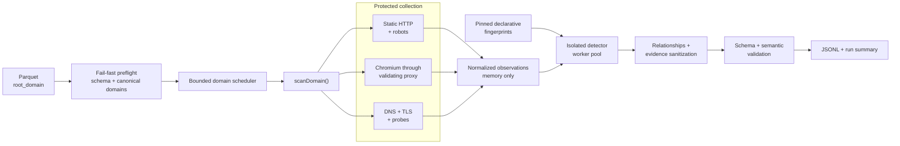
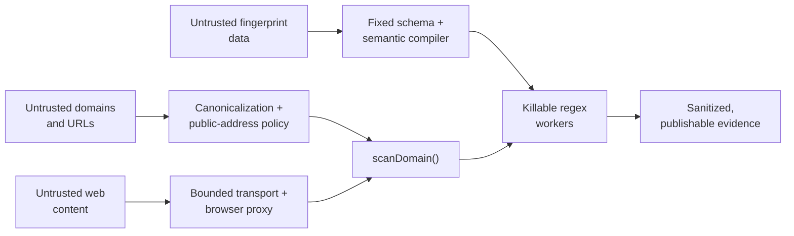
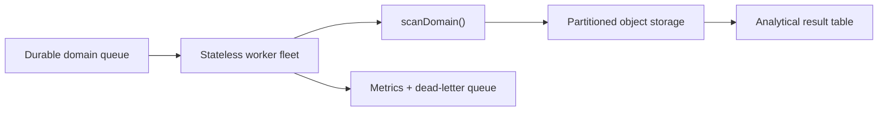

# Website Technologies Scraper

<p align="center">
  <strong>An evidence-first batch scanner for identifying the technologies behind public websites.</strong>
</p>

<p align="center">
  Static HTTP, protected Chromium, DNS/TLS signals, isolated fingerprint matching,<br>
  and a reproducible JSONL result for every input domain.
</p>

<p align="center">
  
  
  <a href="LICENSE"></a>
</p>

<p align="center">
  <a href="#result-at-a-glance">Results</a> ·
  <a href="#architecture">Architecture</a> ·
  <a href="#evidence-you-can-audit">Evidence</a> ·
  <a href="#quick-start">Run it</a> ·
  <a href="#design-trade-offs-and-future-scale">Trade-offs</a>
</p>

This repository is my solution to Veridion's
[Website Technologies Scraper internship challenge](https://veridion.com/company/careers/challenges/internship).
The task is to scan 200 supplied domains, identify as many technologies as
possible, retain evidence for every direct detection, and preserve provenance
for inference. The submission is complete in v0.1.9; experimental tier routing
is documented as a `NO-GO` and is not enabled.

## Result at a glance

| | Final v0.1.9 run |
| --- | ---: |
| Challenge domains processed | **200 / 200** |
| Domains with detections | **165** |
| Direct domain–technology detections | **2,098** |
| Inferred domain–technology detections | **167** |
| Distinct directly evidenced names | **351** |
| Distinct names including inference | **366** |
| Average / p95 active scan time | **9.28 s / 23.5 s** |
| Test suite | **433 passing** |

Veridion reports 477 technologies for the challenge set, but does not publish
the labeled truth set or define the aggregation unit. I therefore report my
direct, inferred, and distinct-name counts separately rather than presenting a
percentage as precision or recall.

The canonical deliverables are:

- [`output/results.jsonl`](https://raw.githubusercontent.com/victorgoreanuf/scraper/main/output/results.jsonl)
  — one validated result per domain (raw download);
- [`output/results.summary.json`](output/results.summary.json) — aggregate
  result, usage, errors, configuration, and provenance;
- [`docs/RESULTS.md`](docs/RESULTS.md) — readable analysis, common technologies,
  evidence examples, limitations, and reproducibility details.

> **Why are 190 records `partial`?** A partial result is useful evidence plus a
> later bounded failure, not a discarded scan. Of those 190 records, 162 still
> contain detections. Conservative browser and detector limits preserve an
> attributable prefix instead of guessing or letting one site block the batch.

## What makes this more than a regex scraper

| Challenge concern | Implementation |
| --- | --- |
| Gather broad technology coverage | Pinned catalog with 7,571 technology definitions; static HTTP, browser, script, DNS, TLS, robots, and probe signals |
| Prove each conclusion | Every direct detection contains its collector, source, locator, stable rule ID, confidence contribution, page, and sanitized match |
| Handle modern sites | Isolated Chromium contexts collect rendered DOM facts, known JavaScript paths, requests, and already-downloaded script bodies |
| Stay reliable | Bounded concurrency, per-domain deadlines, incremental JSONL, record-granular recovery/resume, partial-result preservation, and pool failure isolation |
| Stay safe | All-address SSRF checks, socket pinning, TLS verification, robots enforcement, a validating browser proxy, redaction, and hard resource caps |
| Stay reproducible | Exact runtime, configuration digest, catalog revision/digest, run ID, canonical ordering, JSON Schemas, and semantic validation |

## Quick start

### Requirements

- Node.js `24.19.0` and npm `11.17.0` (pinned in `.node-version` and
  `package.json`);
- OpenSSL 1.1.1 or newer, available as `openssl` on `PATH`, when running the
  TLS tests; the built scanner does not invoke it;
- the official challenge Parquet file saved as `input/domains.parquet`;
- a real public contact URL or email for the crawler User-Agent.

The challenge input is not redistributed in this repository. See
[`input/README.md`](input/README.md) for the source link, expected schema, path,
and checksum.

```sh
git clone https://github.com/victorgoreanuf/scraper.git
cd scraper

# Activate Node 24.19.0 first, then install the locked dependency tree.
npm ci
npm exec -- playwright install chromium
npm run build

# Set CRAWLER_CONTACT outside this example to your own real public contact.
: "${CRAWLER_CONTACT:?set a real https:// or mailto: contact}"

./dist/cli.js \
  --contact "$CRAWLER_CONTACT" \
  --input input/domains.parquet \
  --output output/my-results.jsonl
```

The command writes progress to stderr, one complete result per JSONL line, and
a paired `output/my-results.summary.json`. Existing outputs are never silently
overwritten; use `--resume` for an interrupted compatible run or `--force` only
when replacement is intentional.

Useful commands:

```sh
npm run check       # strict typecheck + all tests
npm run build       # compile the CLI into dist/
./dist/cli.js --help
```

## Architecture

The central unit is deliberately independent of the input and output formats:

```ts
scanDomain(domain, runtimeContext): Promise<DomainResult>
```



| Component | Owns | Does not own |
| --- | --- | --- |
| `input` | Parquet validation and ordered domain streaming | crawling |
| `crawl` | protected observations and budgets | technology decisions |
| `detect` | catalog compilation, matching, relationships | network or filesystem I/O during matching |
| `pipeline` | one domain lifecycle and failure containment | batch input/output formats |
| `output` | semantic validation, incremental JSONL, resume, summary | browser implementation details |

### Trust boundaries



The detailed crawler, detector, output, budget, and evaluation contracts are in
[`docs/TECHNICAL_REFERENCE.md`](docs/TECHNICAL_REFERENCE.md). The fixed wire
contracts are the two JSON Schemas under [`schemas/`](schemas/).

## Evidence you can audit

This is an abridged real detection from the final output. The scanner identified
Shopify on `unnames.com` from a cookie name while never publishing the cookie
value:

```json
{
  "domain": "unnames.com",
  "technology": {
    "name": "Shopify",
    "confidence": 100,
    "type": "direct",
    "pageIds": ["p1", "p2", "p3"],
    "evidence": [{
      "collector": "http",
      "source": "cookie",
      "pageId": "p1",
      "key": "_shopify_s",
      "match": { "kind": "presence", "value": null, "truncated": false },
      "ruleId": "sha256:26f8c710c3d535f9bcfc09e009e7116ef8fac435aed9f7d6c16a7e04565f1ff7"
    }]
  }
}
```

The [results walkthrough](docs/RESULTS.md#real-evidence-examples) links this
example to the submitted artifact and includes two more signals. `confidence`
is a deterministic catalog rule score, not a calibrated probability. A direct
result always has evidence; an inferred result names its supporting parent
without fabricating an observation.

Evidence values are allowlisted and bounded. Cookie values, raw HTML, DOM,
script bodies, credentials, tokens, authorization headers, and sensitive query
values are never persisted. See the complete
[result and evidence contract](docs/TECHNICAL_REFERENCE.md#result-and-evidence-contract-v1).

## Honest limitations

- **No labeled truth set:** the published result can be counted and audited,
  but precision/recall against Veridion's 477 reference cannot be calculated.
- **Conservative browser limits:** 119/200 domains reached a browser bound and
  193 browser-limit errors were retained. This protects runtime and memory but
  can miss late observations.
- **Detector bounds:** 15 domains reached a regex timeout or detector execution
  budget. Confirmed matches were retained; unfinished work was not guessed.
- **Coverage gaps:** 35 domains have zero technologies. Network failures,
  access policy, unsupported responses, and catalog gaps are distinct from a
  proven detector miss.
- **Catalog confidence is not probability:** nearly every strong fingerprint
  reaches 100, so confidence explains rule contribution rather than ranking
  real-world certainty.
- **The web changes:** the artifacts are byte-reproducible, while a future live
  rerun is not expected to receive identical website responses.

No whole detector or browser pool collapsed in the final run. The scanner wrote
all 200 records and preserved earlier evidence when a later stage failed. More
detail is available in [`docs/RESULTS.md`](docs/RESULTS.md).

## Design trade-offs and future scale

These three sections answer the challenge's required debate topics.

### 1. Main issues and how I would tackle them

The hardest accuracy problem is the fingerprint catalog: rules can be stale,
too generic, duplicated, or expensive. I would maintain a small labeled review
set, keep catalog releases digest-pinned, and require multiple positive and
representative negative fixtures for every correction. The exact correction
ledger used here already follows that model instead of editing vendored data.

Collection is inherently incomplete. Sites disappear, block automation, serve
soft-404s, or exceed safe budgets. I would use the existing aggregate limit
telemetry to fix one demonstrated bottleneck at a time, with local fixtures,
rather than globally raising request, byte, selector, or time limits. The
failed tier-routing experiment is kept as a documented `NO-GO`; I would not
ship an optimization that loses evidence breadth.

### 2. Scaling to millions of domains in one or two months

One canonical domain remains one idempotent job. A durable queue would feed
stateless workers that reuse `scanDomain()`, with per-origin rate limiting,
leases, bounded retries, dead-letter handling, partitioned object storage, and
an analytical result table keyed by `(run, domain)`.

At the measured 9.28 s average and three full-scan slots, one current process has
a theoretical ceiling near 28,000 domains/day. One million domains is therefore
about 36 process-days before retries and headroom. A practical first capacity
plan would be:

| Workload | Arithmetic minimum | Initial fleet with ~50%+ headroom |
| --- | ---: | ---: |
| 1 million in 30 days | 2 processes | 3 processes |
| 1 million in 60 days | 1 process | 2 processes |
| 5 million in 30 days | 6 processes | 9 processes |
| 5 million in 60 days | 3 processes | 5 processes |

I would then scale from measured p95 saturation rather than treating this local
average as a service-level guarantee. The current traffic profile projects to
about 73 million browser requests and 1 TB of browser transfer per million
domains, so network egress, Chromium memory, and per-host politeness—not CPU
alone—drive capacity.



Static-first/browser-later routing could reduce this cost, but only after a
frozen router passes on an untouched cohort. Until then, horizontally scaled
full scans are less efficient but methodologically safer.

### 3. Discovering new technologies

I would aggregate only policy-approved, sanitized unknown signals—such as
recurring script hosts/path shapes, generator metadata, public headers, DOM
attributes, and known JavaScript globals—then cluster signals that recur across
unrelated domains. An analyst would confirm each candidate against vendor
documentation and release artifacts, author a declarative fingerprint, and
test it on multiple positive and negative sites before publishing a new
digest-pinned catalog revision.

Aliases, relationships, version extraction, runtime cost, licensing, and
redaction belong in the same review. Raw page content would require a separate
retention and privacy decision; the normal result path would remain evidence
only, never a warehouse of scraped pages.

## Documentation map

- [Results and evidence walkthrough](docs/RESULTS.md)
- [Complete technical reference](docs/TECHNICAL_REFERENCE.md)
- [Engineering decision log](DECISIONS.md)
- [Third-party provenance and notices](THIRD_PARTY_NOTICES.md)
- [Input acquisition and contract](input/README.md)

## Development and reproducibility

The final run used scanner `0.1.9`, Node.js `24.19.0`, Playwright `1.62.1`,
Chromium revision `1234`, and effective catalog digest
`sha256:5aedde4f83d1ad977d646e1495b9b91d4d3b0f6f3acbd34d54906d099da18870`.
All 200 records pass the production JSON Schema and semantic validator, their
domain set matches the supplied Parquet exactly, and rebuilding the summary from
the JSONL is byte-identical.

| Submitted artifact | SHA-256 |
| --- | --- |
| `output/results.jsonl` | `e28b934763e617debc9825aab4c2cc6f27b0b4d9533350068f252ec091dfd6d7` |
| `output/results.summary.json` | `53df7d1daa1f0f868ac3e05482a1f103fa6a82c14e861fb6d10d4807608c227b` |

The writer created the original artifacts as single-link files with mode
`0600`. Git intentionally publishes tracked files as `100644`; the hashes above
identify the submitted bytes.

The submitted revision was verified locally with the pinned runtime and matching
Chromium:

```sh
npm run check
npm run build
```

The catalog is the pinned GPL-3.0 WebAppAnalyzer community snapshot plus a
small exact correction ledger with positive and negative fixtures. Vendored
bytes, source revision, licensing choice, and local modifications are documented
in [`THIRD_PARTY_NOTICES.md`](THIRD_PARTY_NOTICES.md).

## License

This project is distributed under [`GPL-3.0-only`](LICENSE). Third-party
materials retain their own licenses and notices.
