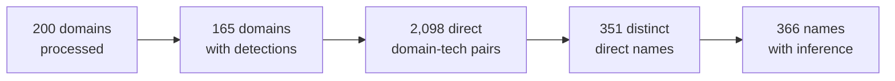

# Final Results and Evidence Walkthrough

> Final challenge run: scanner v0.1.9, full mode, 200 supplied domains.
> [Back to the project overview](../README.md).

## Outcome



| Metric | Value |
| --- | ---: |
| Input/output domains | 200 / 200 |
| Domains with at least one technology | 165 |
| Direct detections | 2,098 |
| Inferred detections | 167 |
| Distinct directly evidenced names | 351 |
| Additional inferred-only names | 15 |
| Distinct names including inference | 366 |
| Average / maximum technologies per domain | 11.325 / 37 |
| Average / p50 / p95 / p99 active time | 9,282.67 / 9,040 / 23,500 / 31,413 ms |

Veridion's challenge page reports 477 technologies, but the labeled truth set
and aggregation unit are not supplied. These figures are therefore an auditable
result summary, not a precision or recall claim.

## How to read status

| Status | Domains | With detections | Meaning |
| --- | ---: | ---: | --- |
| `success` | 3 | 3 | Every required stage completed without error |
| `partial` | 190 | 162 | At least one bounded signal was retained before a later stage error or limit |
| `failed` | 7 | 0 | No usable signal reached detection |

`partial` is intentional failure containment. For example, a domain may retain
headers, scripts, rendered evidence, and technologies even if a later selector
or detector rule reaches its hard budget. The scanner never converts that late
failure into either a fabricated success or a total loss of earlier evidence.

No whole browser or detector pool became unavailable in the final run. All 200
domains received a record and the run summary finalized normally.

## Most frequently emitted technology names

Counts below are the number of domains on which a technology was emitted,
with direct and inferred results separated.

| Technology | Direct | Inferred | Total domains |
| --- | ---: | ---: | ---: |
| jQuery | 91 | 1 | 92 |
| PHP | 43 | 46 | 89 |
| Let's Encrypt | 87 | 0 | 87 |
| MySQL | 0 | 76 | 76 |
| WordPress | 71 | 0 | 71 |
| Open Graph | 67 | 0 | 67 |
| HTTP/3 | 61 | 0 | 61 |
| jQuery Migrate | 59 | 0 | 59 |
| Google Tag Manager | 50 | 0 | 50 |
| Cloudflare | 46 | 2 | 48 |
| Google Analytics | 48 | 0 | 48 |
| Google Font API | 47 | 0 | 47 |
| Priority Hints | 47 | 0 | 47 |
| RSS | 47 | 0 | 47 |
| Font Awesome | 42 | 0 | 42 |

Business-relevant examples include Shopify on 2 domains, WooCommerce on 4,
Salesforce Commerce Cloud on 1, Shopware on 1, Google Analytics on 48,
Facebook Pixel on 5, MailChimp on 4, and PayPal on 2. Counts describe this
specific challenge cohort and are not market-share estimates.

## Real evidence examples

Each direct technology carries one or more evidence records. These are three
sanitized examples from the submitted
[JSONL artifact](https://raw.githubusercontent.com/victorgoreanuf/scraper/main/output/results.jsonl):

| Domain | Technology | Collector and signal | Publishable proof |
| --- | --- | --- | --- |
| `unnames.com` | Shopify | HTTP cookie | Cookie name `_shopify_s` was present; its value was never persisted |
| `szentkristofudvarhaz.hu` | WordPress | HTTP header | `x-pingback` matched the bounded value `/xmlrpc.php` |
| `disneystore.com` | Cloudflare | HTTP header | Header `cf-cache-status` was present |

Abridged canonical Shopify evidence:

```json
{
  "name": "Shopify",
  "confidence": 100,
  "type": "direct",
  "pageIds": ["p1", "p2", "p3"],
  "evidence": [{
    "collector": "http",
    "source": "cookie",
    "pageId": "p1",
    "key": "_shopify_s",
    "match": { "kind": "presence", "value": null, "truncated": false },
    "ruleId": "sha256:26f8c710c3d535f9bcfc09e009e7116ef8fac435aed9f7d6c16a7e04565f1ff7",
    "confidence": 100
  }]
}
```

`confidence` is a deterministic contribution from matched catalog rules, not a
calibrated probability. A direct technology requires observed evidence. An
inferred technology instead contains explicit parent provenance and never
pretends that an inferred relationship was directly observed.

## Where direct evidence came from

The summary reports overlapping attribution counters; they should not be added
together.

| Evidence attribution | Direct domain–technology detections |
| --- | ---: |
| Only HTTP evidence | 462 |
| Any browser evidence | 1,366 |
| Any internal-page evidence | 1,319 |
| Any inspected script-content evidence | 86 |
| Any retained probe evidence | 0 |

Browser and internal-page signals appear frequently in emitted evidence, but
these overlapping counters are attribution—not a counterfactual measurement of
causal lift. The 373 bounded probes across 131 domains produced no final
probe-backed detection in this run; that is a measured low-yield channel, not
hidden work.

## Known coverage limits

- 119 domains reached at least one browser bound; the output contains 193
  `BROWSER_LIMIT_EXCEEDED` errors.
- 15 domains reached a regex timeout, execution limit, or detector-domain
  budget. Confirmed matches were retained before unfinished work stopped.
- 35 domains contain no technology. Twenty-eight are partial collection
  records, so zero is not automatically a catalog false negative.
- Access denials, robots decisions, dead hosts, invalid certificates, unsupported
  content, and live-site changes all affect observable coverage.
- The challenge does not provide per-domain labels, so false-negative and
  false-positive rates cannot be computed from the 477 headline.

The conservative budgets are deliberate. Raising them globally would trade
bounded runtime for an unmeasured amount of additional evidence. The technical
reference records the exact limits and the fixture-driven corrections made
during development.

## Work performed

| Resource | Final run |
| --- | ---: |
| Static HTTP requests | 1,028 |
| Browser requests | 14,601 |
| Pages admitted | 234 |
| Catalog probes | 373 |
| Script bodies inspected | 1,501 |
| Static transferred bytes | 10,687,498 |
| Browser proxy downstream bytes | 201,162,829 |
| Bounded hard-limit hits | 220 |

Browser work dominates: approximately 93% of requests and 95% of transferred
bytes. That observation is the basis for the scaling discussion in the main
README and for keeping experimental tier routing separate from the submitted
full-scan solution.

## Reproducibility

| Item | Identity |
| --- | --- |
| Generation commit | `05d94594543996a709c3cca5858c24f92d9d1c6e` |
| Scanner | `0.1.9` |
| Node.js | `24.19.0` |
| Playwright | `1.62.1` |
| Chromium revision | `1234` |
| Effective catalog | `sha256:5aedde4f83d1ad977d646e1495b9b91d4d3b0f6f3acbd34d54906d099da18870` |
| Configuration | `sha256:2c80fedb1c5288a4c52da1138e05407531d3bb3fd2aef3343e69fc408baa90da` |
| Result JSONL | `sha256:e28b934763e617debc9825aab4c2cc6f27b0b4d9533350068f252ec091dfd6d7` |
| Summary JSON | `sha256:53df7d1daa1f0f868ac3e05482a1f103fa6a82c14e861fb6d10d4807608c227b` |

All 200 lines pass the closed JSON Schema and production semantic validator.
Their unique domain set equals the supplied Parquet domain set exactly. A fresh
accumulator rebuilds the tracked summary byte-for-byte.

The summary includes the deliberately public contact used in the crawler
User-Agent. URL query values, cookie values, credentials, tokens, raw HTML,
DOM, headers, and script bodies are not published outside the evidence
allowlist.

Useful local inspection commands:

```sh
# One domain
jq 'select(.domain == "unnames.com")' output/results.jsonl

# Technology names and counts
jq -s '[.[] | .technologies[] | .name]
  | group_by(.)
  | map({name: .[0], domains: length})
  | sort_by(-.domains, .name)' output/results.jsonl

# Aggregate run report
jq . output/results.summary.json
```

For the full result, redaction, status, and ordering contracts, see
[`TECHNICAL_REFERENCE.md`](TECHNICAL_REFERENCE.md#result-and-evidence-contract-v1).
